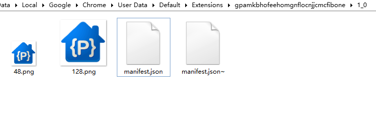
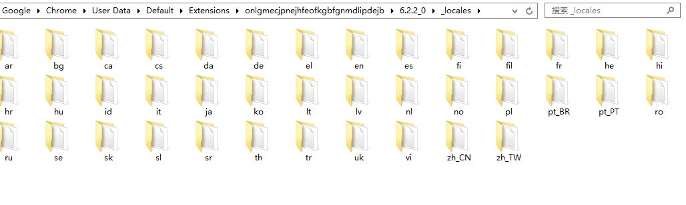
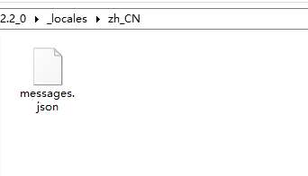

# chrome App guide step 1#

#### ———the Example from native code ####

- First step （finding） :

	1.we open the chrome browser program folder;
	
	2.find out the extension folder，may be it is（C:\Users\"your name"\AppData\Local\Google\Chrome\User Data\Default\Extensions）;  
	
	3.search the keyword "48.png"，but the first your browser must had the chrome app  installed from the *chrome webstore*;  
	
	4.open the picture folder which you can find.
	OK,we open the App folder，first，we can see as followed：
	
	

	

	 
- Second step :
	
 1. we open the manifest.json file,code as :

	(1)
	
	
		{
		   "app": {
		      "launch": {
		         "web_url": "http://code.google.com/hosting/"
		      },
		      "urls": [ "http://code.google.com/" ]
		   },
		   "icons": {
		      "128": "128.png",
		      "48": "48.png"
		   },
		   "key": "MIGfMA0GCSqGSIb3DQEBAQUAA4GNADCBiQKBgQCaIBU9jkZ4h88xOS5wIAqg+nYuO+OKyTdVrMNTjaQIxomGaR32nSjYUbh6Pw74+uUJYZZrEUjMtZBfCepVt8B4/umuFUWYVsbCiNggHHRXvo/Z6ikfzDsln8ZBEKzDXk/J8ht/XoJmiRAR7Zu5zQyJ3loeVrhoZatneFBPZF+C6QIDAQAB",
		   "name": "Google Project Hosting",
		   "update_url": "http://clients2.google.com/service/update2/crx",
		   "version": "1"
		}
	

-----

(2)

			{
			   "app": {
			      "launch": {
			         "container": "tab",
			         "web_url": "http://picasaweb.google.com/"
			      },
			      "web_content": {
			         "origin": "http://picasaweb.google.com"
			      }
			   },
			   "default_locale": "en",
			   "description": "__MSG_appDesc__",
			   "icons": {
			      "128": "128.png",
			      "24": "24.png",
			      "48": "48.png"
			   },
			   "key": "MIGfMA0GCSqGSIb3DQEBAQUAA4GNADCBiQKBgQCrwGVES7Je/YIft7rQKnq3dbZbMP/uf0hZHb3XBhucez1pRptUI4nAvYZAQfUKjzr2qZaun7ydFTqeO8CFdqxmaoau++IKtj3SQBBuQ4IZZxqFiMn3T1aLdFFBOpZxIdkofGjsTojQDGd3hBtfcWzFwwnzFWzXIIrZ+kfaDDgcrQIDAQAB",
			   "name": "__MSG_appName__",
			   "options_page": "http://picasaweb.google.com/lh/settings#",
			   "update_url": "http://clients2.google.com/service/update2/crx",
			   "version": "6.2.2"
			}

  2. form this json,we can dope out（guess） ，<code>"key"，"app"，"name"</code> must the only one，if you app has Multi-language,must set up the <code>_locales</code> folder as followed:

   
   
	
messages.json

	
			{
			   "appDesc": {
			      "description": "App description.",
			      "message": "\u6765\u81EA Google \u7684\u5728\u7EBF\u7167\u7247\u5206\u4EAB\u670D\u52A1\uFF0C\u65B9\u4FBF\u5FEB\u6377\u4E14\u63D0\u4F9B 1G \u514D\u8D39\u5B58\u50A8\u7A7A\u95F4\u3002"
			   },
			   "appName": {
			      "description": "App name.",
			      "message": "Picasa"
			   }
			}
	
so,we can use the dynamic `value` `"__MSG_***__"` to set the View `key` .

	
	
 